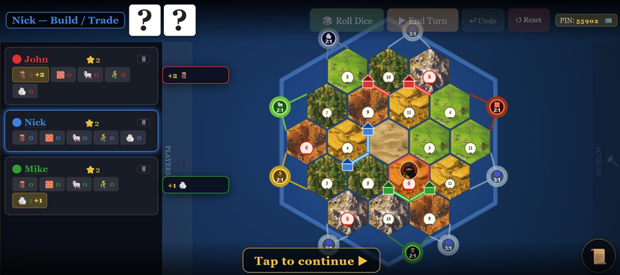
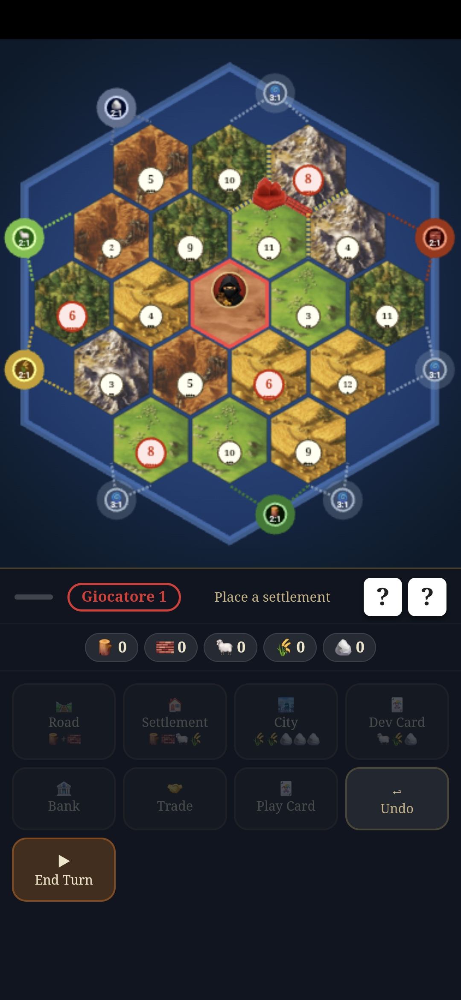

# 🎲 SuperCatan

A full web-based multiplayer implementation of Settlers of Catan, playable from any browser — no app required.

Three skins are included out of the box: **Classic Catan** (standard hex graphics), **Pulp Fiction** (Italian-language skin inspired by the Pulp Fiction universe) and **Pulp Fiction** (English-language version). Skins are automatically filtered by the selected language in the setup screen.





## Features

- **2–4 players** — each player joins from their own device
- **Admin view** — full board on desktop, manages the game
- **📱 Mobile player** — each player scans a QR code and plays from their phone
- **💻 Web player** — join via link on PC or tablet, with full turn management
- **📺 Spectator mode** — watch the game on any device via `/spectator?pin=XXXXX`
- **📱 Phone-only mode** — run the entire game without a desktop; all players join via QR
- **▶ Play button** — in phone-host mode, open any player's view directly inside the PWA
- **Waiting screen** — web players who open their link before the game starts see a waiting screen and auto-join when the game begins
- **Skin system** — fully customizable visuals: hex tiles, buildings, roads, robber, resource names, dev card names and images, VP card names and images; skins support a `lang` field to appear only for specific languages
- **Hidden resources** — optional rule that hides other players' resource counts; trades become blind (proposer can't see what the target has); only deltas are shown to everyone
- **Undo** — available during setup and main game phases
- **Languages** — EN, IT, FR, DE (auto-detected from browser, persisted via localStorage)
- **PWA** — installable on mobile as a full-screen app with install prompt on first visit

---

## How to play

### Standard mode (admin on desktop)

1. Open the game on a desktop browser — this is the **Admin** view
2. Set player names and colors, choose skin and rules
3. Click **Start Game** — a PIN is generated
4. Each player scans the **QR code** (phone → mobile interface) or copies the **Web link** (PC/tablet)
5. Play!

### Phone-only mode (mobile admin)

1. Open the game on a phone
2. Configure players and rules as usual
3. Tap **📱 Play from phone** — a compact host screen appears
4. Each player taps **QR** to scan their personal link, **🔗** to share it, or **▶** to open it directly inside the PWA
5. Everyone plays from their own phone — no desktop board needed

### Rejoin after reload

If the admin closes or refreshes the page, navigate to `/?pin=XXXXX` to rejoin. The PIN is always visible in the top bar during a game.

---

## Game rules options

| Option | Default | Description |
|--------|---------|-------------|
| Start without resources | ✅ On | Players begin with no resources from initial settlements |
| Random ports | Off | Port positions are randomized each game |
| Random numbers | Off | Number tokens are placed randomly instead of the standard spiral |
| Desert center | ✅ On | Desert is always placed at the center hex |
| Quick Game | Off | Win at 7 points instead of 10 |
| Unlimited dev cards | ✅ On | Players can buy multiple dev cards per turn (house rule); turn off for standard rules (1 per turn) |
| Instant Cards | Off | Newly bought dev cards can be played immediately in the same turn |
| Hidden Resources | ✅ On | Each player only sees their own resources; others see only gain/loss deltas. Trades become blind — the proposer cannot see what the target holds. The server validates all trades server-side. |
| Balanced Resources | Off | Hex tiles are distributed so no resource type forms clusters — the algorithm guarantees no hex has more than 1 neighbor of the same resource type, for a more strategic map. |

---

## Dev cards

| Card | Effect |
|------|--------|
| ⚔️ Knight | Move the robber and steal a resource from an adjacent player |
| 👑 Monopoly | Choose a resource — all other players give you all their cards of that type |
| 🌻 Year of Plenty | Take any 2 resources from the bank |
| 🛤 Road Building | Place 2 roads for free |
| ⭐ Victory Point | +1 secret point, revealed only when winning |

Victory Point cards each have a unique subtype (Library, Chapel, Market, University, Great Hall) with individual name and description — customizable per skin.

Stealing a resource after moving the robber (via dice 7 or Knight card) triggers the same resource-change popup as dice rolls, showing gains/losses for all affected players.

---

## Notifications

All players receive real-time toasts for:
- 🎲 Dice rolls with resource gains
- ⭐ Victory point gains
- 🛤 Longest Road acquired **or lost**
- ⚔️ Largest Army acquired **or lost**
- 🃏 Dev card drawn (only the drawing player sees the card details)

---

## Mobile features

- **👥 Players summary** — tap the 👥 button (top-left, next to refresh) to see a popup with every player's points, badges, dev card count, knights played, and resources (own always visible; others only if Hidden Resources is off)
- **Setup phase** — tap the settlement or road button first, then tap the board to place; the board expands automatically when a button is pressed
- **Build mode banner** — shows placement hint while the board is expanded
- **Waiting screen** — shown when joining before the game has started

---

## Skin system

Place skin folders inside `skins/` — each with a `skin.json` manifest. Skins are loaded automatically and appear in the setup screen, filtered by the currently selected language.

### Folder structure

```
skins/
└── myskin/
    ├── skin.json
    ├── preview.png          ← thumbnail shown in skin selector
    ├── hex/
    │   └── wood.png  brick.png  sheep.png  wheat.png  ore.png  desert.png
    ├── buildings/
    │   └── settlement_red.png  city_red.png  (+ blue, green, yellow)
    ├── roads/
    │   └── road_red.png  (+ blue, green, yellow)
    ├── vp/
    │   └── chapel.jpg  library.jpg  market.jpg  university.jpg  palace.jpg
    └── dev/
        └── knight.jpg  monopoly.jpg  year_of_plenty.jpg  road_building.jpg
```

### skin.json reference

```json
{
  "id": "myskin",
  "name": "My Skin",
  "version": "1.0",
  "lang": "en",
  "preview": "preview.png",
  "provides": ["hex", "robber", "buildings", "roads"],

  "hex": {
    "wood":   "hex/wood.png",
    "brick":  "hex/brick.png",
    "sheep":  "hex/sheep.png",
    "wheat":  "hex/wheat.png",
    "ore":    "hex/ore.png",
    "desert": "hex/desert.png"
  },
  "robber": "robber.png",
  "buildings": {
    "settlement": { "red": "buildings/settlement_red.png", "blue": "...", "green": "...", "yellow": "..." },
    "city":       { "red": "buildings/city_red.png",       "blue": "...", "green": "...", "yellow": "..." }
  },
  "roads": {
    "red": "roads/road_red.png", "blue": "...", "green": "...", "yellow": "..."
  },

  "resource_names": {
    "ore": "Gold", "brick": "Weapons", "wheat": "Grain", "wood": "Timber", "sheep": "Wool"
  },
  "resource_emojis": {
    "ore": "💰", "brick": "🔫", "wheat": "🌾", "wood": "🪵", "sheep": "🐑"
  },

  "labels": {
    "road":           "Road",
    "settlement":     "Settlement",
    "city":           "City",
    "port":           "Port",
    "robber":         "Robber",
    "knight":         "Knight",
    "monopoly":       "Monopoly",
    "year_of_plenty": "Year of Plenty",
    "road_building":  "Road Building",
    "longest_road":   "Longest Road",
    "largest_army":   "Largest Army",
    "longest_road_emoji": "🛤",
    "largest_army_emoji": "⚔️",
    "devcard_knight_desc":  "Move the robber and steal a resource",
    "devcard_road_desc":    "Place 2 free roads",
    "devcard_mono_desc":    "Claim all of one resource from everyone",
    "devcard_yop_desc":     "Take any 2 resources from the bank",
    "devname_knight":       "⚔️ Knight",
    "devname_monopoly":     "👑 Monopoly",
    "devname_yop":          "🌻 Year of Plenty",
    "devname_road_build":   "🛤 Road Building",
    "devname_vp":           "⭐ Victory Point",
    "banner_robber":        "Move the robber! Tap a hex.",
    "phase_place_sett":     "Place a settlement",
    "phase_place_road":     "Place a road",
    "mob_build_label_road":       "Tap an edge for the road",
    "mob_build_label_settlement": "Tap a vertex for the settlement",
    "mob_build_label_city":       "Tap your settlement to upgrade",
    "mob_build_label_robber":     "Tap a hex for the robber"
  },

  "vp_cards": {
    "chapel":     { "name": "⛪ Chapel",     "emoji": "⛪", "desc": "A place of worship",      "image": "vp/chapel.jpg" },
    "library":    { "name": "📚 Library",    "emoji": "📚", "desc": "Knowledge is power",      "image": "vp/library.jpg" },
    "market":     { "name": "🏪 Market",     "emoji": "🏪", "desc": "The heart of trade",      "image": "vp/market.jpg" },
    "university": { "name": "🎓 University", "emoji": "🎓", "desc": "Brilliant minds prosper", "image": "vp/university.jpg" },
    "palace":     { "name": "🏰 Palace",     "emoji": "🏰", "desc": "Symbol of your power",    "image": "vp/palace.jpg" }
  },

  "dev_cards": {
    "knight":         { "image": "dev/knight.jpg",         "desc": "Optional custom description" },
    "monopoly":       { "image": "dev/monopoly.jpg",        "desc": "Optional custom description" },
    "yearOfPlenty":   { "image": "dev/year_of_plenty.jpg",  "desc": "Optional custom description" },
    "roadBuilding":   { "image": "dev/road_building.jpg",   "desc": "Optional custom description" }
  }
}
```

### Skin fields reference

| Field | Required | Description |
|-------|----------|-------------|
| `id` | ✅ | Unique identifier, must match folder name |
| `name` | ✅ | Display name shown in the skin selector |
| `lang` | — | If set (`"en"`, `"it"`, `"fr"`, `"de"`), skin only appears when that language is selected. Omit for universal skins (shown for all languages) |
| `version` | — | Informational version string |
| `preview` | — | Path to thumbnail image (shown in selector) |
| `provides` | — | Array of asset categories provided: `hex`, `robber`, `buildings`, `roads` |
| `hex` | — | Per-resource hex image paths |
| `robber` | — | Robber image path |
| `buildings` | — | Settlement and city images per player color |
| `roads` | — | Road images per player color |
| `resource_names` | — | Override resource display names |
| `resource_emojis` | — | Override resource emojis |
| `labels` | — | Override any UI string (see reference above) |
| `vp_cards` | — | Override VP card name, emoji, description and image |
| `dev_cards` | — | Override dev card image and optional description |

### Skin override rules

- All fields are **optional** — omit any section to fall back to Classic behavior
- `resource_names` and `resource_emojis` override only the keys you provide
- `labels` keys override specific UI strings; missing keys fall back to i18n translation
- `vp_cards` supports optional `image` (falls back to emoji)
- `dev_cards` supports optional `desc` (falls back to i18n description)
- Skins without `lang` are **universal** and always visible regardless of selected language

---

## Debug mode

Open `/?debug=1` to show a debug panel in the setup screen.

| Debug option | Description |
|---|---|
| Force dev card | Forces a specific card type as the next draw |
| 💰 10 resources | All players start the main phase with 10 of each resource |
| 🎲 Force dice | Forces a specific dice total (2–12) on every roll |

A red banner `🐛 DEBUG: ...` confirms active debug options. Debug mode is invisible in normal play.

---

## Setup

```bash
npm install
node server/index.js
```

Open `http://localhost:3000` in your browser.

## Deploy

Tested on [Render](https://render.com) — set start command to `node server/index.js`.

> **Note:** The server keeps all game state in memory. On free-tier hosting (e.g. Render free plan), the server sleeps after inactivity and loses all state on restart. Generate player QR codes and start the game in the same session to avoid token expiry.

## Demo

[https://supercatan.onrender.com/](https://supercatan.onrender.com/)

---

## About me

My real name is Vanni Brutto, for friends... just call me Zanac 👋

## Support

Hey dude! Help me out for a couple of 🍻 or a ☕!

[](https://bmc.link/zanac)
